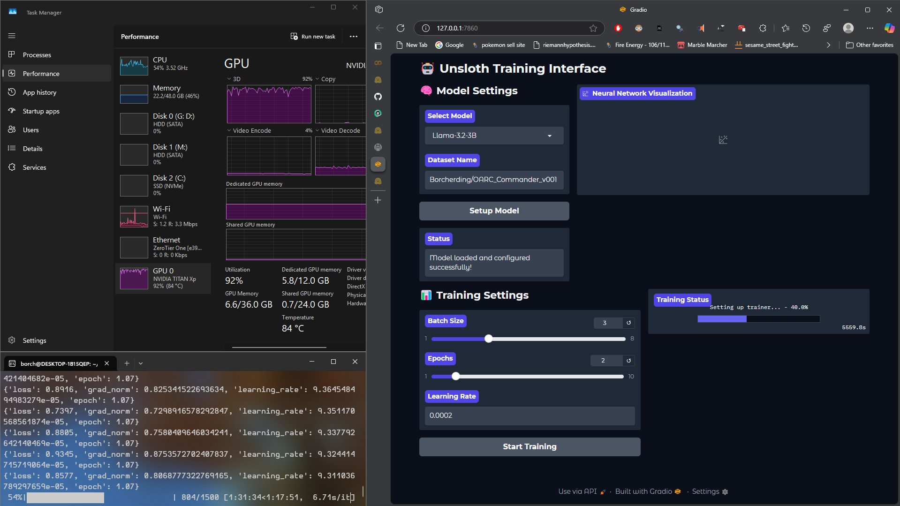

# UnslothAPI

<p align="center">
  
</p>
<p align="center">
  <a href="https://docs.unsloth.ai/"></a>
  <a href="https://discord.gg/fv6Mq5Xv28"></a>
</p>

Local API and UI for fine-tuning language models using Unsloth.

## Features

- Fine-tune multiple models including Llama and Phi variants
- Integrated Gradio UI for training monitoring
- GGUF model conversion
- Model merging capabilities
- Real-time training visualization

## Setup

0. Run on linux, or [setup WSL](https://learn.microsoft.com/en-us/windows/wsl/install)

1. Create conda environment:
```bash
conda create --name unsloth_env \
    python=3.11 \
    pytorch-cuda=12.1 \
    pytorch cudatoolkit xformers -c pytorch -c nvidia -c xformers \
    -y
conda activate unsloth_env
```

2. Install requirements:
```bash
pip install -r requirements.txt
```

3. Create `.env` file with:
```
HF_TOKEN=your_huggingface_token
```

4. Reference unsloth documentation for a deeper understanding:

[Unsloth Github](https://github.com/unslothai/unsloth)

[Unsloth Documentation](https://docs.unsloth.ai/)

[Matt William's Finetuning Tips](https://www.youtube.com/watch?v=W2QuK9TwYXs&ab_channel=MattWilliams)

## Usage

Start API server:
```bash
./unslothAPI.sh
```

Start UI:
```bash
./unslothUI.sh
```

Access:
- API: http://localhost:8000
- UI: http://localhost:7860
- 
## Usage
<p align="center">
  
</p>

## Directory Structure

```
├── models/         # Trained models
├── datasets/       # Training datasets
├── outputs/        # Training outputs
├── *.py           # Python source files
├── *.sh           # Shell scripts
└── requirements.txt
```

## Supported Models

- Llama-3.1-8B
- Phi-3-medium
- Llama-3.2 variants (1B, 3B)
